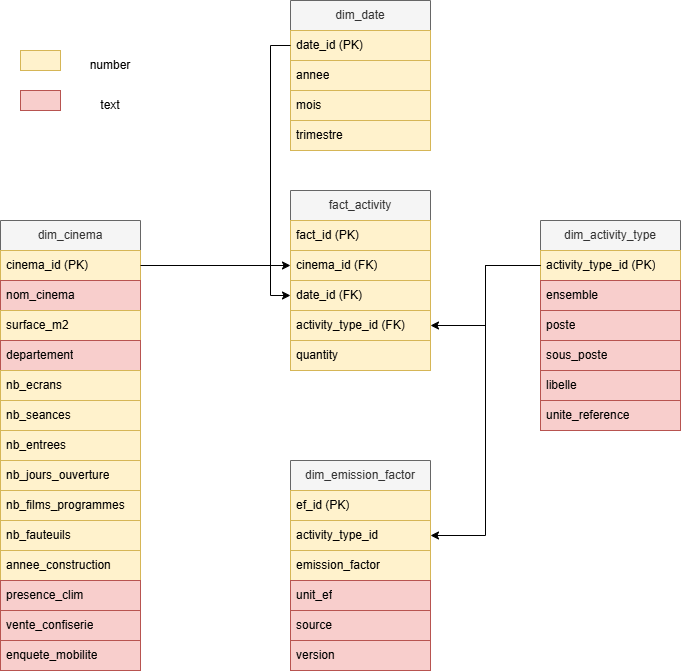

Schéma conceptuel des données
----------------------------

   **Figure 1 — Schéma conceptuel proposé pour la modélisation des données COUNT.**

   Ce schéma illustre une proposition de modélisation en étoile implémenté en PostgreSQL, 
   distinguant les données de contexte (dimensions) des données d'activité (table de faits),
   dans une logique d'aide à la décision et de calcul d'impact écologique.

   Il s'agit d'un schéma conceptuel élaboré à des fins de formalisation
   méthodologique et documentaire. Il ne correspond pas au schéma opérationnel 
   final du projet COUNT.

Accès au code source
--------------------

Les scripts SQL sont disponibles dans le dépôt GitHub associé à cette
documentation :

- Schéma PostgreSQL :
  https://github.com/linh-dinh-1012/count-documentation/blob/main/sql/01_schema_cinema_carbon.sql

- Script d'initialisation des données :
  https://github.com/linh-dinh-1012/count-documentation/blob/main/sql/02_insert_data.sql

