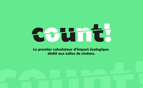

Présentation du projet COUNT
============================

    
Cadre du projet
---------------

COUNT est un calculateur d'empreinte écologique destiné aux salles de cinéma, 
lancé par le collectif Cinéma Uni pour la Transition (CUT!).

Le projet s'inscrit dans un programme soutenu par France 2030 - Alternatives
vertes pour la culture, avec le soutien du Centre national du cinéma et de
l'image animée (CNC). Le développement de l'outil est assuré par l'Association
pour la transition bas carbone (ABC), en lien avec les acteurs du secteur
cinématographique.

COUNT constitue le premier outil spécifiquement conçu pour prendre en compte
les réalités opérationnelles des salles de cinéma, en intégrant notamment les
enjeux liés à l'énergie, aux équipements, à la mobilité des spectateurs, à la
confiserie et aux activités de fonctionnement.

Positionnement et objectifs
----------------------------

COUNT a pour objectif de fournir aux exploitants de salles de cinéma une
estimation simplifiée et accessible de leur empreinte carbone, réalisable en
moins de trente minutes. L'outil propose une approche pédagogique et
opérationnelle, destinée à sensibiliser les acteurs du secteur aux enjeux
environnementaux et à accompagner leurs démarches de transition.

Les résultats produits par COUNT ne se substituent pas à un Bilan Carbone®
complet, mais reposent sur une compilation de données sectorielles issues
notamment des travaux de Cinéo, groupement de salles indépendantes privées,
ainsi que sur l'intégration de facteurs d'émission référencés dans la base de
données de l'ADEME, dont certains sont inédits.

Périmètre fonctionnel
---------------------

Le calculateur prend en compte plusieurs postes d'impact spécifiques à
l'exploitation cinématographique, parmi lesquels :

- les consommations énergétiques des bâtiments  
- les équipements techniques et informatiques  
- la mobilité des spectateurs et des équipes  
- les activités de confiserie et de restauration  
- certains flux de matières et déchets  

À moyen terme, le projet prévoit une évolution vers une approche
multi-critères de l'empreinte environnementale, intégrant par exemple des
indicateurs de pollution au-delà des seules émissions de gaz à effet de serre
(GES).

Statut de la contribution documentée
------------------------------------

La présente documentation correspond à un travail de contribution technique et
de formalisation méthodologique réalisé en appui au projet COUNT. Elle vise à
décrire les choix de modélisation des données, les principes de calcul et les
logiques de reproductibilité, sans constituer la documentation officielle du
projet.

Ressources et références
------------------------

- Site officiel du projet COUNT :
https://count.cut-collectif.fr/

- Référentiel méthodologique et outillage Bilan Carbone® (ABC) :
https://github.com/ABC-TransitionBasCarbone/bilan-carbone